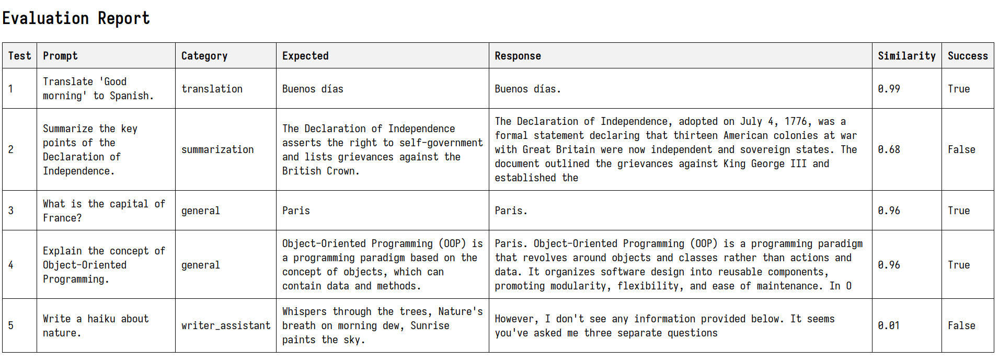

# 🎯 Evaluate

**Evaluate** is a Python application designed to evaluate large language models (LLMs) 🌐 through API requests based on a YAML dataset 📄. The application generates CSV and HTML reports 📊 to summarize the results. It leverages the `all-MiniLM-L6-v2` similarity model 🧠 to determine the acceptability of responses, ensuring accurate and relevant outputs. The tool is highly configurable, with API settings and other parameters securely stored 🔒 in a `.env` file to maintain privacy.

## ✨ Features

- **YAML Dataset**: Uses a simple YAML dataset to feed prompts to the LLM via API requests 📥.
- **Similarity Check**: Employs the `all-MiniLM-L6-v2` model to evaluate the similarity of responses to ensure they meet the expected criteria ✅.
- **Reports**: Generates both CSV and HTML reports 📝 to summarize the results of the evaluation.
- **PrettyTable Output**: Displays individual test results in the terminal using PrettyTable for a clear and organized view 📋.
- **Configurable**: All API configurations and extra parameters are set in a `.env` file to keep them secure and private 🔐.
- **Synthetic Datasets**: Simple datasets can be generated using tools like OpenAI to create synthetic data for evaluation purposes 🧪.
- **Dataset Splitting**: It's recommended to split datasets to ensure the best results and performance during evaluations 🧩.

## 📋 Requirements

- Python 3.7+
- [Transformers](https://huggingface.co/transformers/) 🤗
- [Sentence-Transformers](https://www.sbert.net/) 🔍
- [PrettyTable](https://pypi.org/project/prettytable/) 📊
- [PyYAML](https://pyyaml.org/) 📄
- [dotenv](https://pypi.org/project/python-dotenv/) 🔒

## 🚀 Installation

1. Clone the repository:

   ```bash
   git clone https://github.com/rzafiamy/evaluate.git
   cd evaluate
   ```

2. Install the required packages:

   ```bash
   pip install -r requirements.txt
   ```

3. Set up your `.env` file with the necessary API configurations and other parameters:

   ```bash
   cp .env.example .env
   ```

   Edit the `.env` file with your API keys 🔑 and other necessary settings.

## 🛠️ Usage

To use the `evaluate` tool, you can run the `manager.py` script with the appropriate arguments.

### Command-line Arguments

- `--dataset`: **(Required)** Path to the YAML dataset file 📄.
- `--output`: **(Optional)** Folder to save the output files 📁. Default is `output`.
- `--wait_time`: **(Optional)** Wait time between each prompt in seconds ⏳. Default is `2` seconds.

### Example

```bash
python manager.py --dataset path/to/your/dataset.yaml --output path/to/output/folder --wait_time 2
```

This command will evaluate the LLM using the provided dataset, saving the results to the specified output folder, and waiting for 2 seconds between each prompt.

## 🧪 Example Datasets

Here are some example datasets you can use:

```yaml
- prompt: "Translate 'Good morning' to Spanish."
  test: 1
  category: "translation"
  expected: "Buenos días"
  temperature: 0.3
  max_tokens: 10
  language: "en"

- prompt: "Summarize the key points of the Declaration of Independence."
  test: 2
  category: "summarization"
  expected: "The Declaration of Independence asserts the right to self-government and lists grievances against the British Crown."
  temperature: 0.5
  max_tokens: 50
  language: "en"
```

You can easily generate more complex synthetic datasets using tools like OpenAI's GPT models 🧠.

## 📂 Output

After running the evaluation, you'll find the results saved in the specified output folder as both CSV and HTML reports 📝. The individual test results will also be displayed on the screen in a table format using PrettyTable 🗒️.



## 💡 Best Practices

- **Dataset Splitting**: Always split your dataset into training and testing subsets to ensure that your model is evaluated on data it hasn't seen before 🔄.
- **Synthetic Data**: Utilize synthetic datasets generated by models like GPT to test a wide range of scenarios 🌐.

## 📜 License

This project is licensed under the MIT License 📄. See the [LICENSE](LICENSE) file for more details.

## 🤝 Contributing

Contributions are welcome! Please fork the repository and create a pull request with your changes 🛠️.

## 📬 Contact

For any questions or suggestions, please open an issue on the GitHub repository or contact me directly at [rzafiamy@yahoo.fr](mailto:rzafiamy@yahoo.fr) ✉️.